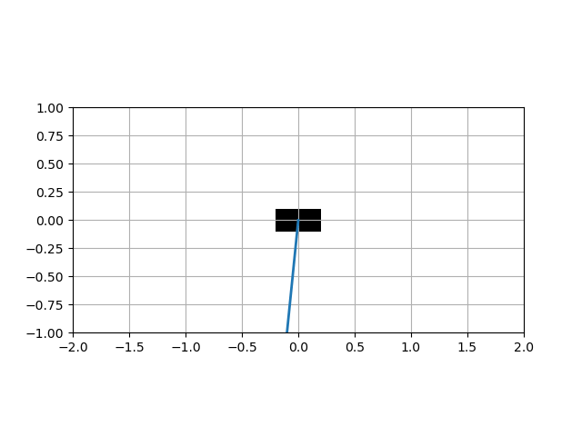
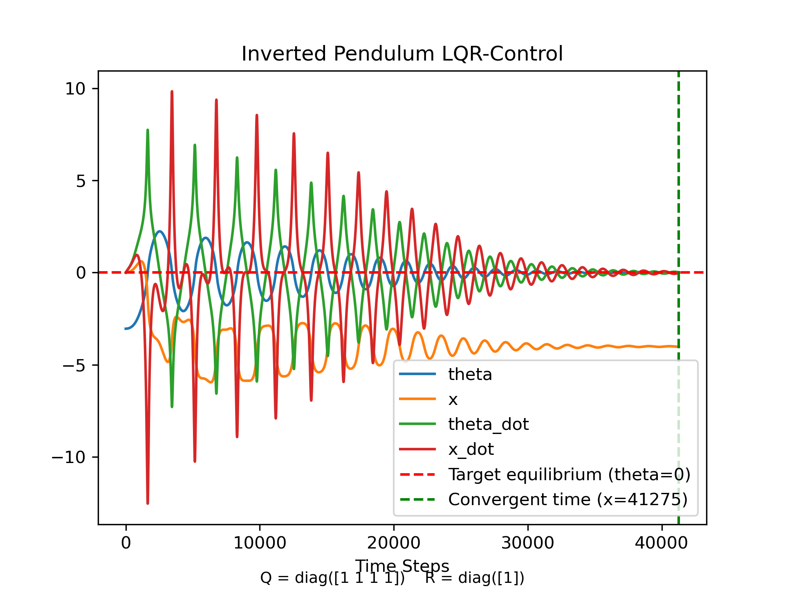
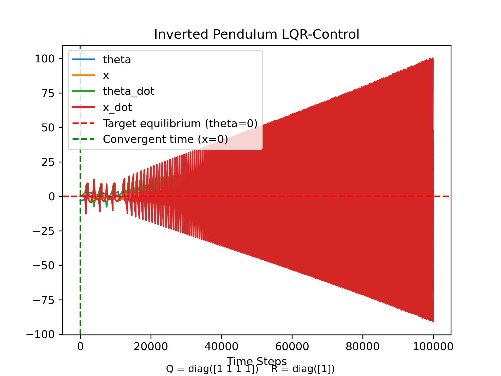
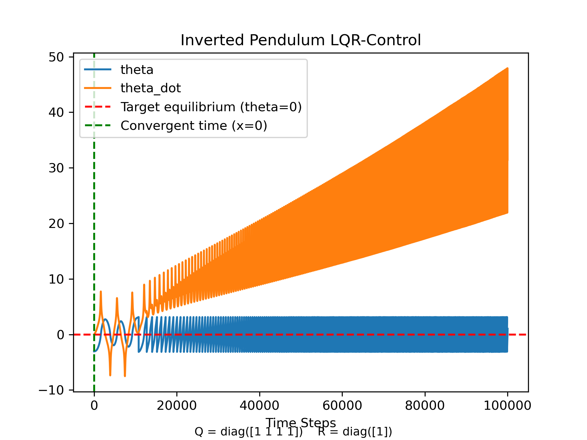
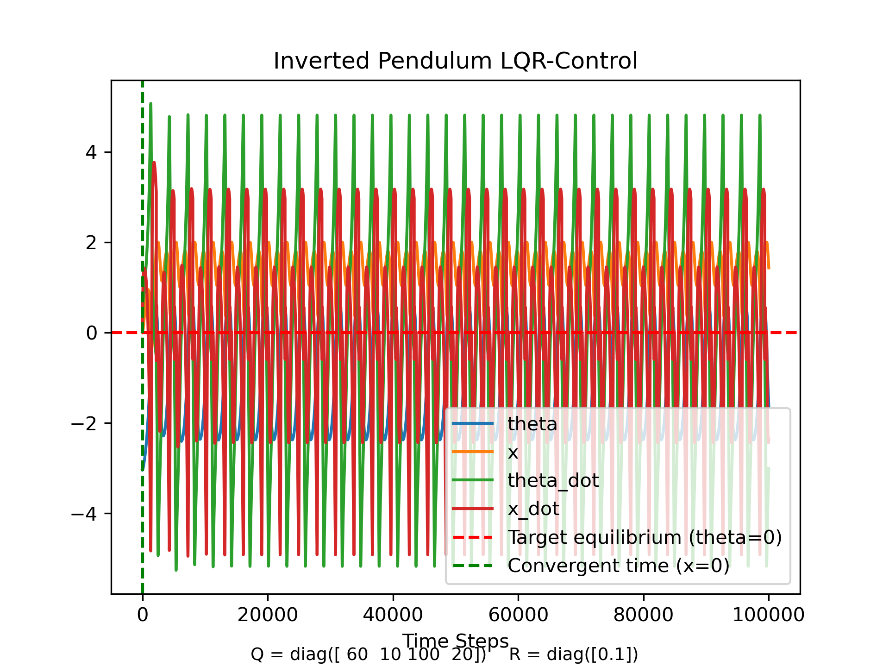
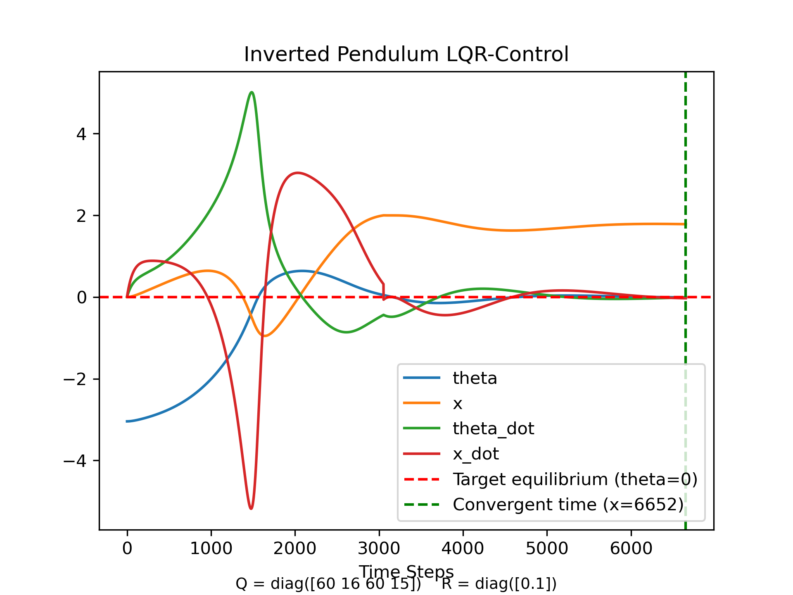

# Project Overview

This project studies stabilization of an inverted pendulum on a cart using LQR control. The controller is designed via linearization but applied to the full nonlinear dynamics. We investigate the effect of rail constraints on stability and Q/R tuning.



# System modelling

## Coordinates and assumptions
* State $$q = [x, \theta], \\ \underline{x} = [q, \dot{q}] = [x, \dot{x}, \theta, \dot{\theta}]$$
* Angle convention $$Upright: \theta = 0$$
* The pendulum is a point mass
* The rigid string is very light
* No friction and any disturbance
* We can observe every state in $\underline x$ such that $\underline y = \underline x$

## System Dynamics
* $m_c$ : mass of the cart, $m_p$: mass of the point mass, $l$: length of the rigid string
* $x$: vector from origin to CM of the cart, $\theta$: angle of the rigid string from the upright 
*  Using  Lagrangian mechanics to derive non-linear dynamics 

$$T = \frac1 2 m_c \dot{x}^2 + \frac 1 2 m_p (\dot{x} + l\dot{\theta}\cos{\theta})^2 + \frac 1 2m_p(l\dot{\theta}\sin{\theta})^2$$

$$U = -m_pgl\cos{\theta}$$ 

$$L = T - U$$

$$\frac{d}{dt} \frac {\partial}{\partial \dot{\underline{x}}}L  - \frac {\partial}{\partial \underline{x}}L = \tau$$

* From the Manipulator equation, $M(\underline{q})\underline{\ddot{q}} +  C(\underline{q}, \underline{\dot{q}}) \underline{\dot{q}}= \tau_g(\underline{q}) + Bu$, where:

$$M(\underline{q}) = \begin{bmatrix}  
m_c+m_p & m_pl\cos{\theta} \\  
m_pl\cos{\theta} & m_pl^2  
\end{bmatrix}, 
C(\underline{q}, \dot{\underline{q}}) = \begin{bmatrix}  
0 & -m_pl\dot{\theta}\sin{\theta} \\  
0 & 0  
\end{bmatrix},$$
$$
\tau_g(\underline{q}) = \begin{bmatrix}  
0 \\  
-m_pl\sin{\theta} 
\end{bmatrix},
B = \begin{bmatrix}  
1 \\  
0
\end{bmatrix},$$

* To linearize the equation, we need this form $\underline{\dot{x}} = \underline{f}(\underline{x})$
* Note that $\underline{\dot{x}} = [\dot{x}, \ddot{x}, \dot\theta, \ddot\theta]$ and we can obtain $\dot{x}$ and $\dot{\theta}$ from $\underline{x}$, thus, in order to know $\underline{\dot{x}}$, we only need to know $\underline{\ddot{q}}$, where $\underline{\ddot{q}} = [\ddot{x}, \ddot{\theta}]$. And we can obtain it from:
$$\underline{\ddot{q}}  = M^{-1}(\tau_g + Bu - C \underline{\dot{q}})$$ 
* $u$ is the input, and, in this case, force on the cart.

## Linearization
As I will be using LQR as a controller, it requires the system to be linear as it has to use $A$ and $B$ from the $\underline{\dot{x}} = A\underline{x} + Bu$ to compute $K$

In order to linearize the non-linear system, I need to choose an equilibrium point, and linearize the system around the point. In our system, there are two equilibrium points, $\theta = 0$ (upright) and $\theta = \pi$ (hanging down). As our goal is inverted pendulum, we must choose $\theta = 0$ as our equilibrium point.

Idea of linearization is, given $\underline{\dot{x}} = \underline{f}(\underline{x})$ where $\underline{f}(\underline{x})$ is a non linear function, we approximate the function around an equilibrium point as a linear function. 

$$\begin{split} 
\underline{\dot{x}} & = \underline{f}(\underline{x}, u) = \underline{f}(\bar{\underline{x}} + \Delta{\underline{x}}, u + \Delta{u}) \\
                 & = \underline{f} (\bar{\underline{x}}, u) + \frac {D} {D\underline{x}} f(\bar{\underline{x}}, \bar{u}) \Delta{\underline{x}} + \frac {D^2} {D\underline{x}^2} f(\bar{\underline{x}}, \bar{u}) \Delta{\underline{x}}^2 + ... + \frac {D} {Du} f(\bar{\underline{x}}, \bar{u}) \Delta{u} + \frac {D^2} {Du^2} f(\bar{\underline{x}}, \bar{u}) \Delta{u}^2 + ...
                                  \end{split}$$
                                
where $\bar{\underline{x}}$ is a state vector at an equilibrium point.
                                
* $\Delta{\underline{x}}$ is a vector from an equilibrium point to a nearby point, as it is the nearby point, $\Delta{\underline{x}}$ is small, thus, $\Delta{\underline{x}}^2, \Delta{\underline{x}}^3, ...$ are incredibly small, so we can neglect them! Thus
$$\Delta\underline{\dot{x}} = \frac D {D\underline{x}} f(\bar{\underline{x}}, \bar{u}) \Delta{x}+ \frac D {Du} f(\bar{\underline{x}}, \bar{u}) \Delta{u}$$

* Note: $\frac D {D \underline{x}} f$ is a Jacobian matrix. 
*Thus $A = \frac D {D\underline{x}} f(\bar{\underline{x}}, \bar{u}), B = \frac D {Du} f(\bar{\underline{x}}, \bar{u})$, I can, now, use LQR!


## Controller, LQR
### Overview of the control
*the image is from https://www.mathworks.com/discovery/optimal-control.html*

LQR is an optimal control (optimality is defined with respect to the quadratic cost and the linearized model). Unlike pole placement, you don't have to choose stable eigenvalues ($\lambda < 0$), and then solve for K, in LQR, we find the optimal K by choosing characteristic. Q and R are penalizing bad performance (error between desired state and the current state) and actuator effort (how aggressive we can command the actuator) respectively. I acknowledge that most robotics systems use discrete time system, but in this simulation, I choose to use continuous time system. Thus my cost function is

$$J = \int_{0}^{\infty} (\underline{x}^{T}Q\underline{x} + u^{T}Ru) dt  $$

and our goal here is to find u such that minimize the cost function.
From math, $K$ is the optimal gain that results in minimizing the cost function J
*there is more mathematical detail on how to compute K, but I am not gonna write it out here as it so long, but I encourage you to look up the calculation detail from this MIT's Underactuated Robotics book [https://underactuated.mit.edu/lqr.html]*
* $Q$ is a diagonal matrix, and, in this case,

$$Q = \begin{bmatrix}  
Qx & 0 &0 & 0\\  
0& Q\dot{x}  &0 & 0 \\
0 & 0 & Q\theta & 0 \\
0 & 0 & 0 & Q\dot{\theta}
\end{bmatrix}$$

* $R$ is a number in this case because we only have one actuator, you can see as $B = [1, 0]$, thus u is just a 1x1 matrix or a number.
* $K$ is the optimal gain 1x4 matrix, 

$$K = \begin{bmatrix}  k_1 & k_2 &k_3 & k_4 \end{bmatrix}$$ 

### Connect the dots
I mentioned earlier that u is just a number, and as the diagram above shows, $u = -Kx$. And from our linearized model, $\delta{\dot{\underline{x}}} = A\delta{\underline{x}} + B\delta{u}$ where $\delta{x}$, $\delta{u}$ are vectors from equilibrium state and control u to current state and current control u. We get that:

$$u = -K\delta{x} = -K(x -\bar{x})$$

And this is exactly command u we send!!

# Architecture

- **Controller**
As mentioned, to use LQR control, we need to compute $K$, and to do so, we need $A$ and $B$ from *linearized dynamics*, $\Delta\underline{\dot{x}} = \frac D {D\underline{x}} f(\bar{\underline{x}}, \bar{u}) \Delta{x}+ \frac D {Du} f(\bar{\underline{x}}, \bar{u}) \Delta{u}$. 

- **Simulation**
Remember, the real world is not linear but a *non-linear dynamics system*. Thus our simulation must be run on the non-linear dynamics system, $M(\underline{q})\underline{\ddot{q}} +  C(\underline{q}, \underline{\dot{q}}) \underline{\dot{q}}= \tau_g(\underline{q}) + Bu$

## Conclusion
```
   non-linear dynamics: M(q), C(q, q_dot), tau(q), u, equilibrium state x_bar
                                      |
                                      |
                                      V
                             Linearized dynamics
                                      |
           choose  Q, R  ------>    A, B
                                      |
                                      V
                           Solve P = riccati equation
                           And K = inv(R) @ B.T @ P
                                      |
                                      V
                             u = - K @ (x - x_bar)<-----|
                                      |            x = x + x_dot * dt
                                      V                 |
                               non-linear dynamics -> x_dot
```

# Constraint
* Rail limit
This is for a level of realism where the cart can not travel infinitely.
	* The cart runs on a 4 meters rail
	* Once the cart bumps into the end of the rail, it bounces back with 40% of its original velocity


# Q/R Tuning
I have done this 2 times, one with rail limit and one without. So I am going to divide into 2 sections.
Q and R are chosen to reflect acceptable state magnitudes and actuator aggressiveness rather than physical constants.

## Without rail limit
* Initial Intuition: 
	* R is limited between 0.1 - 1 to protect the actuator.
	* $Q_x$ is not limited because the cart can go anywhere it needs, thus it can be small.
	* $Q_{\dot{x}}$ is not limited because the cart can go anywhere that means it can go as fast as it needs, thus it also can be small.
	* $Q_{\theta}$ we needs $\theta$ to be 0 as fast as possible, thus it must be high
	* $Q_{\dot{\theta}}$ if $\theta$ changes too fast, it is hard to make it becomes 0, it is limited. This must be moderately high
* Tuning process
	* Starts with Q = diag(1, 1, 1, 1) and R = 1
	* Tuning  each one Q separately, switch to another Q once convergent time gets higher or stop reducin
* Observation 
High $Q_{\theta}$ works great for the system without rail limit. Convergent time inverse proportion to the $Q_{\theta}$, keep $Q_{\dot{\theta}}$ about half of the $Q_{\theta}$ works great.


## With rail limit
* Initial Intuition:
	* R is limited between 0.1 - 1 to protect the actuator
	* $Q_x$ is limited because the cart should not go too far because it might bump into the end of the rail. It must be moderately high.
	* $Q_{\dot{x}}$ is limited because the cart cannot go anywhere. It must be moderately high.
	* $Q_{\theta}$ the same without rail limit, we want to minimize it, thus it has to be high.
	* $Q_{\dot{\theta}}$ the same without rail limit, we want to minimize it, thus it has to be high.
* Tuning process
	* Starts with Q = diag(1, 1, 1, 1) and R = 1
	* Tuning  each one Q separately, switch to another Q once convergent time gets higher or stop reducing.
* Observation
Convergent time is lowest when $Q_{\theta} \approx Q_{x}$ and $Q_{\dot\theta} \approx Q_{\dot x}$. Unlike the system without rail limit, with $Q_{\theta} \gg Q_{x}, Q_{\dot{x}}$, it results in oscillating and never converge. This is likely caused by repeated impacts at the rail boundaries.

# Results

## Baseline 
$Q = diag([1, 1, 1, 1])$, $R = [1]$

*System without rail*



*System with rail*



As you can see, you can barely see anything. Here is the graph without $x$, $\dot{x}$



## System with rail

For the system with rail limit, unlike the system without rail, when $Q_x$ < $Q_{\theta}$, $\theta$ would not converge to 0 but, instead, oscillating.



After hours of tuning, I have discovered that $\theta$ would converge to 0 when $Q_x \approx Q_{\theta}$ and $Q_{\dot{x}} \approx Q_{\dot{\theta}}$.



# Limitation

* Perfect state access $\underline{y} = \underline{x}$
* No noise or disturbance
* No sensor delay
* Local stability
